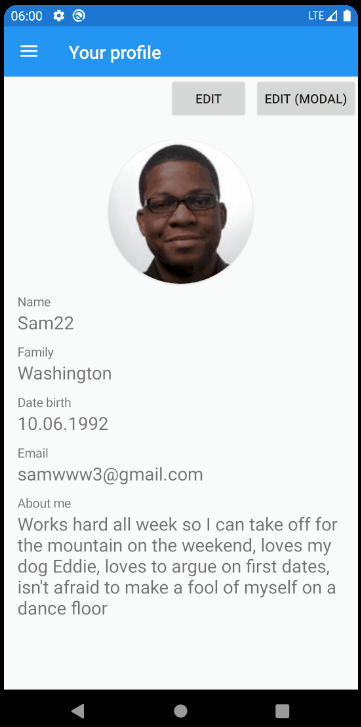
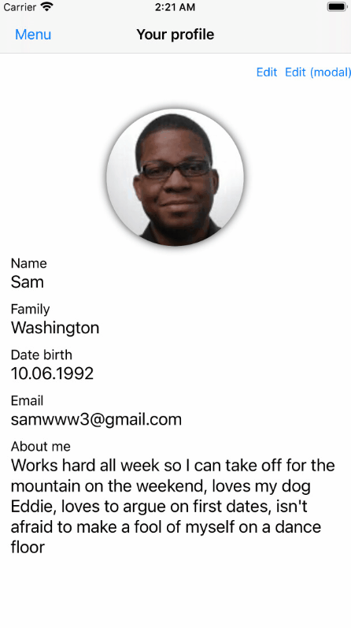
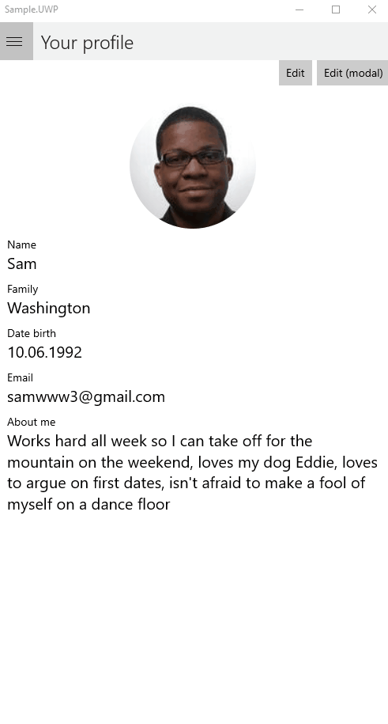

# NavigationSam
Allows can intercept navigation back by user for Xamarin.Forms

## Nuget Installation
https://www.nuget.org/packages/NavigationSam

<table>
	<thead>
		<tr>
			<th>Droid</th>
			<th>iOS</th>
			<th>UWP</th>
		</tr>
	</thead>
	<tbody>
		<tr>
			<td></td>
			<td></td>
			<td></td>
		</tr>
  </tbody>
</table>

## Supported Platforms
 - Android
 - iOS
 - UWP not support (use native method OnBackButtonPressed)
 
 
 ## Install android project
```c#
// Pay attention to the inherited class!!! FormsAppCompatActivitySam
public class MainActivity : global::NavigationSam.Droid.FormsAppCompatActivitySam
{
     protected override void OnCreate(Bundle savedInstanceState)
     {
          TabLayoutResource = Resource.Layout.Tabbar;
          ToolbarResource = Resource.Layout.Toolbar;
          
          base.OnCreate(savedInstanceState);

          NavigationSam.Droid.Preserver.Preserve();
          Xamarin.Forms.Forms.Init(this, savedInstanceState);
          LoadApplication(new App());
     }
}
```

## Install iOS project
```c#
public partial class AppDelegate : global::Xamarin.Forms.Platform.iOS.FormsApplicationDelegate
{
     public override bool FinishedLaunching(UIApplication app, NSDictionary options)
     {
          global::Xamarin.Forms.Forms.Init();
          LoadApplication(new App());
	  
          NavigationSam.iOS.Preserver.Preserve();

          return base.FinishedLaunching(app, options);
     }
}
```


## To use interception in UWP, use the method OnBackButtonPressed

```c#
public partial class SamplePage : ContentPage, INavigationPopInterceptor
{
     public SamplePage()
     {
          InitializeComponent();
     }
     
     public async Task<bool> RequestPop()
     {
          bool res = true;

          if (CheckChanges())
              res = await DisplayAlert("Warning",
                  "If you exit, all unsaved changes will be lost", 
                  "Exit", "Cancel");

          return res;
     }
     
     protected override bool OnBackButtonPressed()
     {
          Device.BeginInvokeOnMainThread(async () =>
          {
               bool res = await RequestPop();
               if (res)
                    await Navigation.PopAsync();
          });
          return true;
     }
}
```
